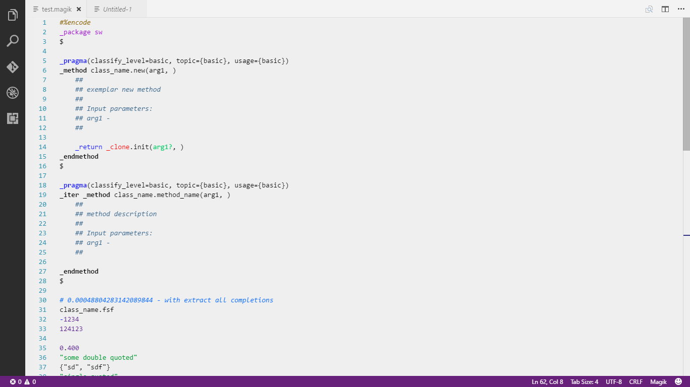

# Magik Wand

Custom language support for Smallworld Magik.

## Features

1. Rich syntax support

1. Custom theme for magik which colorizes Magik specific keywords with different colors

1. Full fledged snippets support for keywords and common methods.  

## Release Notes

### 1.0.0

Initial release
